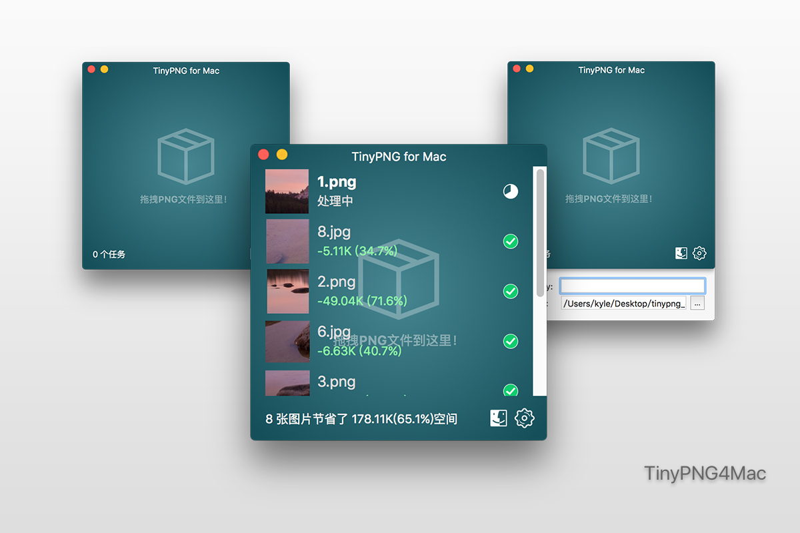

# TinyPNG4Mac
TinyPNG client for Mac

This is a client of [TinyPNG](https://tinypng.com) for Mac, with which you can compress pngs without open browser and manually download images, all you need to do is just drag and drop.

[中文](./README_ZH.md)

### Version 0.93

1. Support **JPG** and **JPEG**.

### Version 0.9 brings a lot of change.

1. Whole new design UI.
2. New workflow and easy to use.
3. Custom ouput path support.
4. Sorted task list.
5. Chinese support.

### Usage

1. Regist a KEY using your email at [link](https://tinypng.com/developers/subscription). You can also do this from Client since there is a button on the window.
2. Paste your key to window. (You can edit it when you need to)
3. Drag images to the window.

### Download

\>\>\>\>\>\> [Link](https://github.com/kyleduo/TinyPNG4Mac/raw/master/archive/TinyPNG4Mac.app.zip) \<\<\<\<\<\<

Check "Anywhere" in `Preferences -> Security & privacy` if you can not open this app. Just for the first time, and I suggest you uncheck it after you open this app for security.

### Preview

#### Gif

### Thanks

[droptogif](https://github.com/mortenjust/droptogif) -- A very useful client for convert video to gif. I learnt how to create window from that project.

### License

Developed by [@kyleduo](https://github.com/kyleduo) and available under the [MIT](http://opensource.org/licenses/MIT) license.