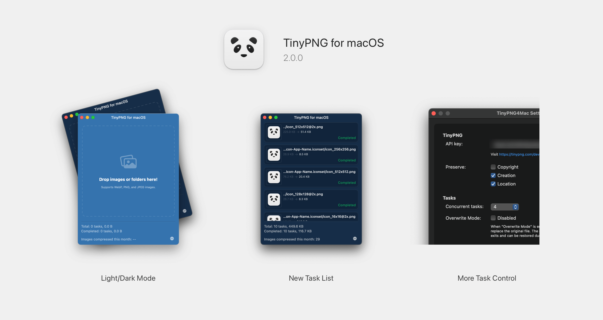

# Tiny Image

>  The App's name is renamed to Image Image for property sake, since previous name contains TinyPNG and macOS.

TinyPNG for macOS is a 3rd-party client of [TinyPNG](https://tinypng.com). With which you can compress images without opening browser.

[中文](./README_ZH.md)

### 2.1.0 Release Note

> Version 2.0.0+ supports macOS 13 Ventura and later. For lower version systems, please use the previous version.

1. Fix issue #65: task error when drag images to dock icon when App closed.
2. Disable SandBox mode. Now Tiny Image can automatically create output folder if it's not exits.
3. Show current save mode (Overwrite Mode / Save As Mode) in Main window.
4. Add output folder icon to Main window which supports click to open.
5. Add frequency used function entries to task row.

[Change Log](./CHANGE_LOG.md)

### Usage

1. Register an **API key** at [link](https://tinypng.com/developers).
2. Paste your API key to `Settings` window. (You can edit it when you need to)
3. Drag images or directories containing images to the window.

### Download

Through [Release Page](https://github.com/kyleduo/TinyPNG4Mac/releases)

Check  `System Settings -> Security & privacy` page if you can not open this app.

### Thanks

[droptogif](https://github.com/mortenjust/droptogif) -- A very useful client for convert video to gif. I learnt how to create window from that project.

### Licenses

Developed by [@kyleduo](https://github.com/kyleduo) and available under the [MIT](http://opensource.org/licenses/MIT) license.
