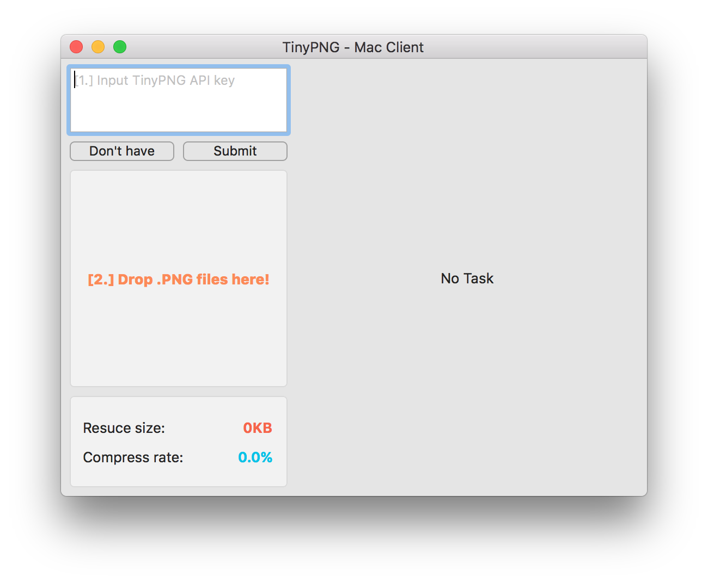
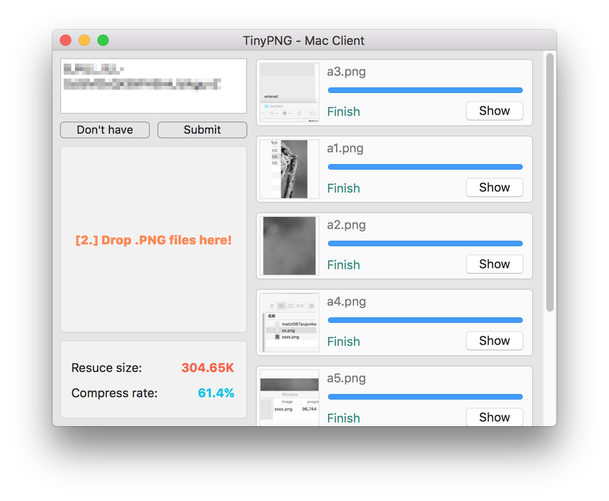

# TinyPNG4Mac
TinyPNG client for Mac

This is a client of TinyPNG for Mac, with which you can compress pngs without open browser and just drag and drop.

### Usage

1. Regist a KEY using your email at [link](https://tinypng.com/developers/subscription). You can also do this from Client since there is a button on the window.
2. Paste your key to window. (Just need for first use)
3. Drag images to the receiver and drop them.

### Download

\>\>\>\>\>\>[app](./archive/tinypng.app.zip)\<\<\<\<\<\<

Check "Anywhere" if you can not open this app. Just for the first time, and I suggest you uncheck it after you open this app for security.

### Preview

### License

Developed by [@kyleduo](https://github.com/kyleduo) and available under the [MIT](http://opensource.org/licenses/MIT) license.