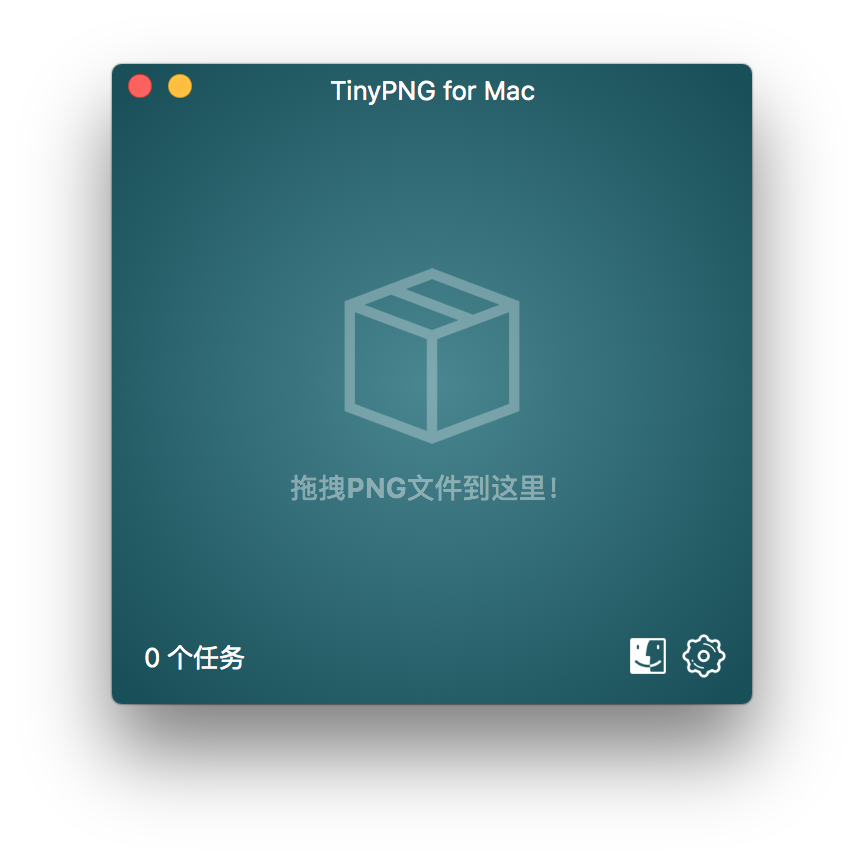
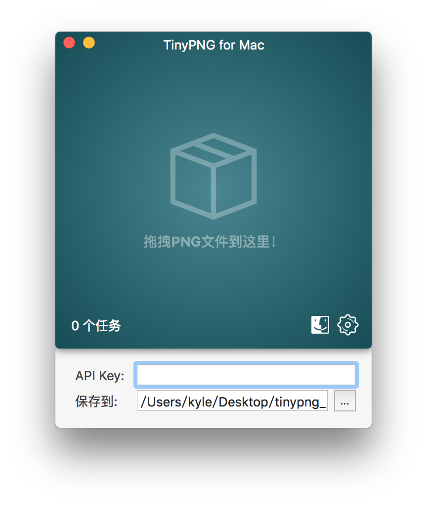
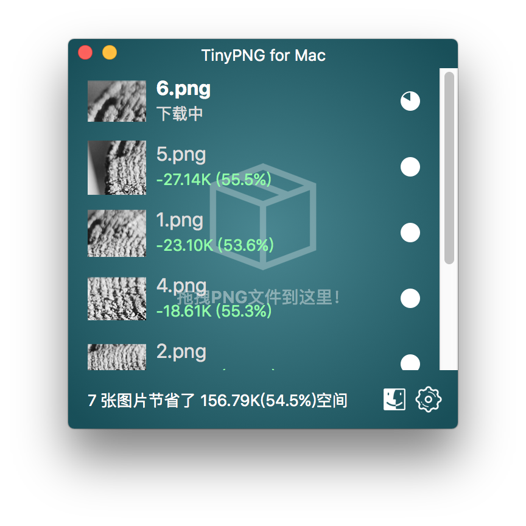

# TinyPNG4Mac
TinyPNG client for Mac

这是TinyPNG的Mac客户端。TinyPNG提供了PNG图片的“几乎无损”压缩服务。使用TinyPNG4Mac，你可以通过简单的拖拽完成对PNG图片的压缩，无需打开浏览器，无需手动下载图片。

### 0.9版本带来了很多更新

1. 重新设计的UI；
2. 新的流程更加易用，安全；
3. 支持自定义保存路径；
4. 任务列表排序；
5. 支持中文。

### 使用

1. 到[这里](https://tinypng.com/developers/subscription)注册API Key. 你也可以在打开TinyPNG4Mac的时候注册。
2. 将API Key粘贴到界面上。
3. 拖拽图片到窗口中。

### 下载

\>\>\>\>\>\> [点击这里下载](./archive/TinyPNG4Mac.app.zip) \<\<\<\<\<\<

第一次打开可能出现“无法打开”的提示，请到`设置 -> 安全性与隐私`里面勾选`所有来源`。出于安全考虑，建议打开之后关闭这个选项。

### 预览

### 致谢

[droptogif](https://github.com/mortenjust/droptogif) -- 实用的视频转Gif的工具。我在里面学习了如何创建Window。

### 协议

Developed by [@kyleduo](https://github.com/kyleduo) and available under the [MIT](http://opensource.org/licenses/MIT) license.